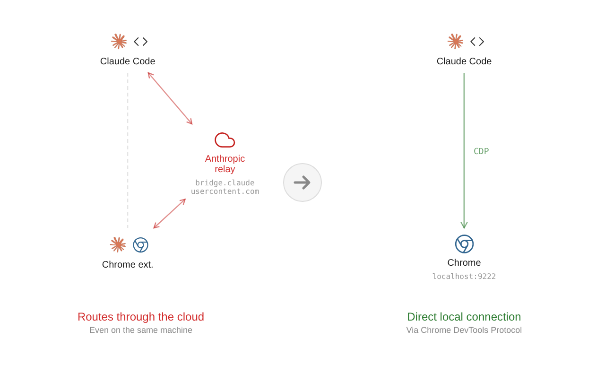

# claude-cdp-bridge

MCP server that gives Claude Code direct control of Chrome via Chrome DevTools Protocol (CDP). Connects over WebSocket to Chrome's debug port, bypassing extensions, native messaging hosts, and cloud relays. Your real Chrome session, visible window, cookies, logins, controlled through 14 MCP tools.

## Architecture



All traffic stays on localhost. Websites see a normal Chrome browser, not headless, no automation flags.

## Tools

| Category | Tool | Description |
|----------|------|-------------|
| Navigation | `navigate` | Go to a URL, wait for load |
| | `tab_list` | List all open tabs |
| | `tab_new` | Open a new tab |
| | `tab_close` | Close a tab |
| | `tab_switch` | Switch active tab |
| Interaction | `click` | Click element by CSS selector |
| | `type` | Type text into an element |
| | `key_press` | Send keyboard events (Enter, Escape, Tab, arrows) |
| Reading | `read_page` | Get visible text content |
| | `screenshot` | Capture page as PNG (viewport or full page) |
| | `javascript_exec` | Run arbitrary JS in page context |
| DOM Analysis | `get_page_structure` | Headings, landmarks, forms, pagination, stats |
| | `get_interactive_elements` | All visible links, buttons, inputs with labels |
| | `get_dom_tree` | Accessibility tree approximation (500 nodes, 8 levels) |

## Prerequisites

- **Node.js 18+**
- **Google Chrome**

## Setup

### 1. Install dependencies

```bash
npm install
```

### 2. Launch Chrome with the debug flag

**Windows:**

Modify your Chrome shortcut's Target field to include the flag:

```
"C:\Program Files\Google\Chrome\Application\chrome.exe" --remote-debugging-port=9222
```

**macOS:**

```bash
/Applications/Google\ Chrome.app/Contents/MacOS/Google\ Chrome --remote-debugging-port=9222
```

**Linux:**

```bash
google-chrome --remote-debugging-port=9222
```

Close all Chrome windows before launching with the flag for the first time. Chrome is single-instance-per-profile, so if Chrome is already running, the flag gets silently ignored.

**Optional: separate profile**

If you don't want to close your main Chrome, you can force a separate instance with its own profile:

```bash
chrome --remote-debugging-port=9222 --user-data-dir="/path/to/cdp-profile"
```

This starts a fresh profile on first launch (no existing logins/cookies), but they persist across sessions in that directory.

### 3. Register as an MCP server

**Claude Code CLI:**

```bash
claude mcp add --transport stdio cdp-bridge -- node /path/to/cdp-bridge/src/cdp-bridge.mjs
```

**VS Code (settings.json):**

```json
"cdp-bridge": {
    "command": "node",
    "args": ["/path/to/cdp-bridge/src/cdp-bridge.mjs"]
}
```

Adjust the path to wherever you cloned this repository.

### 4. Restart Claude Code

The 14 browser tools should now appear in your tool list.

## How It Works

1. Chrome runs with `--remote-debugging-port=9222`, exposing a local HTTP + WebSocket API
2. Claude Code spawns `cdp-bridge.mjs` as a stdio MCP server
3. On startup, the bridge discovers open tabs via `http://localhost:9222/json/list`
4. Each tab gets a WebSocket connection to `ws://localhost:9222/devtools/page/{tabId}`
5. MCP tool calls are translated to CDP commands and sent over the WebSocket
6. Results flow back through the same chain

## Screenshots

The `screenshot` tool accepts an optional `savePath` parameter to control where PNGs are saved. Defaults to `screenshots/` in the project directory. The directory is created automatically if it doesn't exist.

## Browser Navigation Skill

A companion skill is included at `skill/cdp-browser-nav/SKILL.md` that guides Claude on how to use these tools effectively:

- **Visual mode**: screenshot first, navigate by what you see, click elements visually (for browsing)
- **Mechanical mode**: use DOM scripts and JS for structured data extraction

To use it, copy the skill file to `.claude/skills/cdp-browser-nav/SKILL.md` in your project or Claude Code skills directory.

## Troubleshooting

**"Cannot connect to Chrome on port 9222"**
- Close all Chrome windows and relaunch with `--remote-debugging-port=9222`
- Chrome ignores the flag if another instance is already running

**"No active tab"**
- Use `tab_list` or `tab_new` first

**Element click/type fails**
- Take a screenshot to see the actual page state
- Some elements are images or inside iframes, use coordinates via `javascript_exec`
